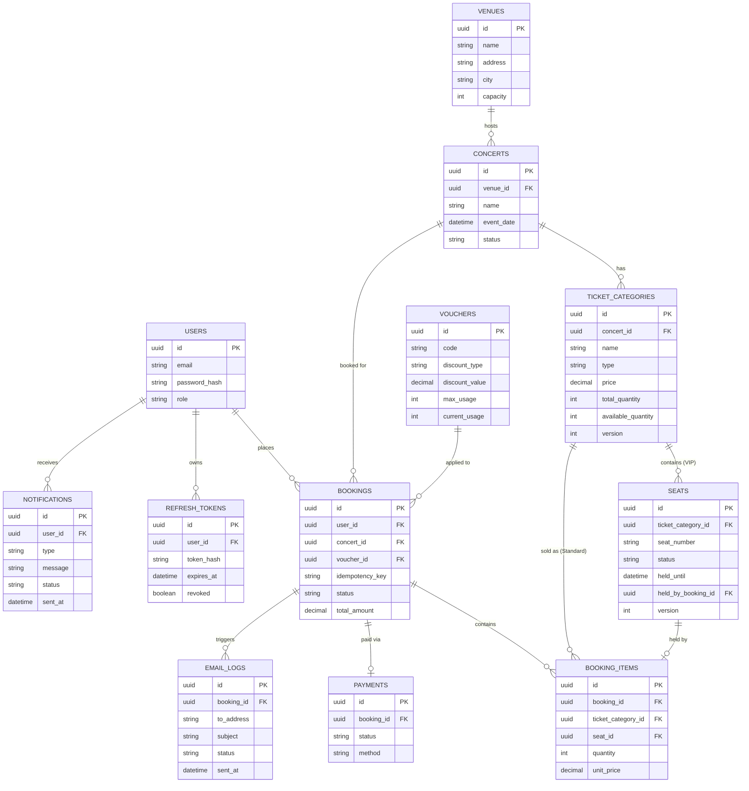

```mermaid
erDiagram
  USERS ||--o{ BOOKINGS : places
  USERS ||--o{ REFRESH_TOKENS : owns
  USERS ||--o{ NOTIFICATIONS : receives
  VENUES ||--o{ CONCERTS : hosts
  CONCERTS ||--o{ TICKET_CATEGORIES : has
  CONCERTS ||--o{ BOOKINGS : "booked for"
  TICKET_CATEGORIES ||--o{ SEATS : "contains (VIP)"
  SEATS ||--o| BOOKING_ITEMS : "held by"
  TICKET_CATEGORIES ||--o{ BOOKING_ITEMS : "sold as (Standard)"
  BOOKINGS ||--o{ BOOKING_ITEMS : contains
  VOUCHERS ||--o{ BOOKINGS : "applied to"
  BOOKINGS ||--o| PAYMENTS : "paid via"
  BOOKINGS ||--o{ EMAIL_LOGS : triggers

  USERS {
    uuid id PK
    string email
    string password_hash
    string role
  }
  REFRESH_TOKENS {
    uuid id PK
    uuid user_id FK
    string token_hash
    datetime expires_at
    boolean revoked
  }
  VENUES {
    uuid id PK
    string name
    string address
    string city
    int capacity
  }
  CONCERTS {
    uuid id PK
    uuid venue_id FK
    string name
    datetime event_date
    string status
  }
  TICKET_CATEGORIES {
    uuid id PK
    uuid concert_id FK
    string name
    string type
    decimal price
    int total_quantity
    int available_quantity
    int version
  }
  SEATS {
    uuid id PK
    uuid ticket_category_id FK
    string seat_number
    string status
    datetime held_until
    uuid held_by_booking_id FK
    int version
  }
  VOUCHERS {
    uuid id PK
    string code
    string discount_type
    decimal discount_value
    int max_usage
    int current_usage
  }
  BOOKINGS {
    uuid id PK
    uuid user_id FK
    uuid concert_id FK
    uuid voucher_id FK
    string idempotency_key
    string status
    decimal total_amount
  }
  BOOKING_ITEMS {
    uuid id PK
    uuid booking_id FK
    uuid ticket_category_id FK
    uuid seat_id FK
    int quantity
    decimal unit_price
  }
  PAYMENTS {
    uuid id PK
    uuid booking_id FK
    string status
    string method
  }
  NOTIFICATIONS {
    uuid id PK
    uuid user_id FK
    string type
    string message
    string status
    datetime sent_at
  }
  EMAIL_LOGS {
    uuid id PK
    uuid booking_id FK
    string to_address
    string subject
    string status
    datetime sent_at
  }
```